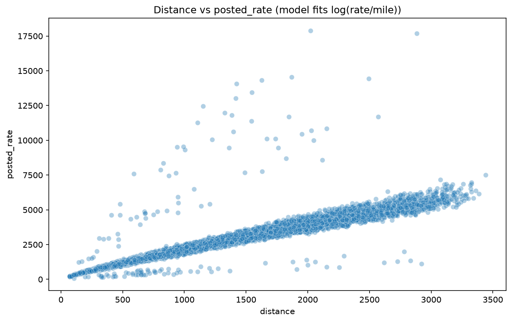
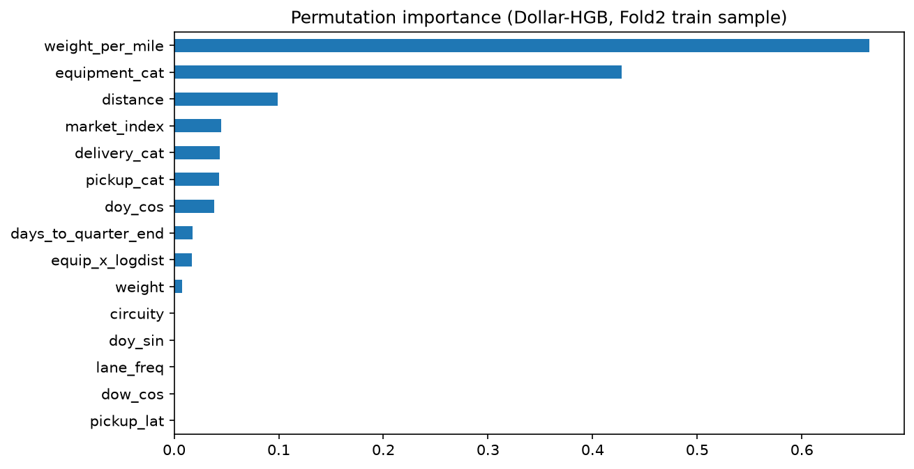

# Spotter Freight Rate Prediction

## 1. The Challenge: Freight Rate Prediction
**Objective:** Forecast spot freight rates (`posted_rate` in USD) for US trucking lanes in a forward horizon (Nov/Dec 2025).

To handle the massive variance across different haul lengths, our model doesn't predict raw dollars. Instead, we predict **`log(rate_per_mile)`**.


*Notice how variance explodes as distance increases — predicting log(RPM) stabilizes this variance.*

---

## 2. Robust Data Integrity
Real-world freight data is messy. We discovered that ~1.4% of training rows had completely corrupt labels (e.g., $10,000 for a 50-mile trip).

Instead of naive z-scores, we built a robust quadratic log-log filter using the Median Absolute Deviation (MAD). 

```python
# train.py snippet: Dropping corrupt rows in training ONLY
def flag_corrupt_labels(df):
    log_d = np.log(df['distance'].clip(lower=1.0))
    log_rpm = np.log(df['posted_rate'] / df['distance'])
    
    # Robust quadratic fit ignoring extreme outliers
    poly = np.polynomial.Polynomial.fit(log_d, log_rpm, deg=2)
    residuals = log_rpm - poly(log_d)
    
    # 6x MAD threshold
    mad = np.median(np.abs(residuals - np.median(residuals)))
    return np.abs(residuals - np.median(residuals)) > 6 * mad * 1.4826
```
*Crucially, this is applied to **training data only**. Inference rows are never dropped.*

---

## 3. Strict Inductive Imputation
The feature `market_index` is powerful, but we won't have it for future validation dates. Instead of peeking at validation batches (data leak), we built a safe fallback ladder.

```python
# preprocessing.py snippet: The fallback ladder
class MarketImputer(BaseEstimator, TransformerMixin):
    def fit(self, X, y=None):
        # 1. Exact Date median
        self.date_map_ = X.groupby('date')['market_index'].median()
        # 2. Month median (for unseen days in known months)
        self.month_map_ = X.groupby(X['date'].dt.month)['market_index'].median()
        # 3. Day of Week median
        self.dow_map_ = X.groupby(X['date'].dt.dayofweek)['market_index'].median()
        # 4. Global fallback
        self.global_ = X['market_index'].median()
        return self
```
*Result: Single-row inference yields the exact same prediction as batch inference.*

---

## 4. The Architecture: DollarHGBRegressor
We designed a custom model class that optimizes for the business goal: **absolute dollar error**.

```python
# modeling.py snippet: Dollar-space optimization
class DollarHGBRegressor(BaseEstimator, RegressorMixin):
    def fit(self, X, y, sample_weight=None):
        # Train HGB natively on categorical strings
        self.model_ = HistGradientBoostingRegressor(
            categorical_features="from_dtype",
            max_iter=300
        ).fit(X, y, sample_weight=sample_weight) # weight = distance!

        # Duan Smearing: Corrects mathematical bias from log-transformation
        resid = y - self.model_.predict(X)
        self.log_smearing_ = np.log(np.clip(np.exp(resid), 0.2, 5.0).mean())
        return self
```
*By passing `sample_weight=distance`, the algorithm penalizes percentage errors on long hauls much more heavily.*

---

## 5. Model Selection & Insights
The combination of distance-weighting, native categoricals, and HistGradientBoosting **crushed** the baseline models.

* We reduced the pipeline artifact size from **800MB** (ExtraTrees) to **3MB** (HGB).
* We improved Fold-2 Mean Absolute Error from **$59.27** down to **$39.28**.


*Distance, Equipment Code, and Market Index carry the most predictive power.*

---

## 6. Final Business Deliverable
The pipeline reliably forecasts rates for unseen days, capturing weekly seasonality (weekend dips) without overfitting. 

This is our final December forecast for the Lexington, KY → Fort Wayne, IN lane (Dry Van, 32,000 lbs).


**Mean Predicted Rate:** $796.61  
**Average MAE:** ~$40 - $65 per load
