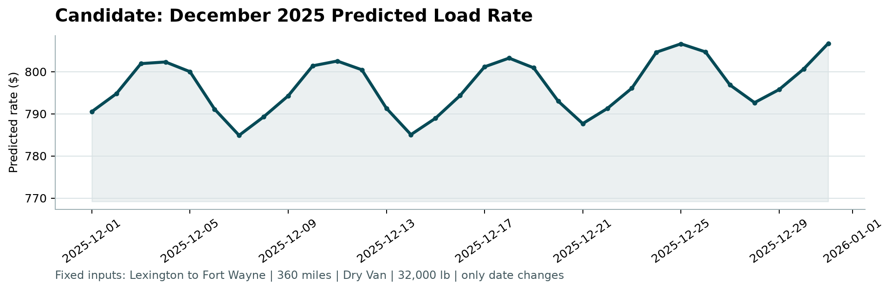

# Spotter Freight Rate Prediction

Spot freight rate (`posted_rate`, USD) forecasting for US trucking lanes, built for forward-horizon prediction (Nov/Dec 2025).

Deliverables:
1. `output/validation_predictions.csv`: 12,000 predictions for the unlabelled validation loads (Nov 1 - Dec 31, 2025).
2. `output/december_predictions.csv`: 31 daily predictions for the fixed lane Lexington, KY to Fort Wayne, IN (360 mi, Dry Van, 32,000 lb).

## Quick start

```bash
git clone https://github.com/SID4288/spotter.git
cd spotter
python -m venv venv
source venv/bin/activate          # Windows PowerShell: venv\Scripts\Activate.ps1
python -m pip install -r requirements.txt
python -m pip install notebook      # only needed to open the notebooks

python train.py                   # regenerates outputs + metrics.json + 3MB pipeline.joblib
python score.py --predictions output/validation_predictions.csv --december-predictions output/december_predictions.csv
# PowerShell multi-line (use backtick, not `\`):
# python score.py --predictions output/validation_predictions.csv `
#                 --december-predictions output/december_predictions.csv
# Production guards (slices + drift, CI-gated):
# python score.py --predictions output/validation_predictions.csv --december-predictions output/december_predictions.csv --validation-inputs data/validation.csv --train-data data/train_test.csv --metrics-json notebooks/results/modelling/metrics.json --fail-on-drift
# Single-row inference (~22ms warm, budget 50ms):
# python predict.py --file payload.json
```

Python 3.10+ (tested on 3.12). Dependencies: the three packages the scorer needs (matplotlib, numpy, pandas) plus scikit-learn (model) and seaborn (EDA plots only). `train.py` is deterministic (`random_state=42`); the notebooks call the same code.
Expected scorer output:

```text
Validated 12,000 final predictions.
Validated 31 fixed December predictions.
Created chart: scorer_results/candidate_december.png
Final validation metrics are calculated by Spotter after submission.
```

## December 2025 forecast



* Mean predicted rate **$796.61** (about $2.21/mile), in line with the lane's own history (Dry Van loads on this lane, Jan-Oct: roughly $760-$935).
* **Weekly pattern:** weekend dips (Dec 6-7, 13-14, 20-21, 27-28).
* **Shape:** peak **$806.71 on Dec 31**, trough $784.89 on Dec 7 (range ~$22). Inductive December `market_index` (train month/dow medians, no validation peeking); treat Dec 31 level as uncertain.
* **Holiday caveat:** Dec 25 is predicted mid-range. The model has no holiday feature and cannot learn Christmas from Jan-Oct data, so do not read this as a holiday forecast. The whole-month swing is tiny against a per-load MAE of $40-65.

## Method

| Step | What and why |
| :--- | :--- |
| Label cleaning | 677 training rows (1.4%) have rates inconsistent with distance (robust quadratic fit on log-log, 6 x MAD, fitted on training rows only per fold; full-train fit used for the final model). Training-only; inference path (`pipe.predict` / `predict.py`) never drops rows. |
| Input repair | Inductive only (single-row == batch). 292 sign-flipped weights made positive; missing weights use equipment median → global; missing `distance` uses training median; missing `market_index` uses frozen training lookups date → month → dow → global (no `groupby` on inference frames; Nov-Dec unseen dates fall to month/dow/global). Unknown equipment → code -1 + NaN categorical bin. `last_stats_` exposes fallback rates (alert if global > 2%). |
| Target | `log(rate per mile)` with `sample_weight=distance` (dollar-space) + Duan smearing `S=mean(exp(resid))` inside `DollarHGBRegressor` so `exp(pred)*distance` is unbiased. |
| Features | 18 numeric (coordinates, distance, clipped circuity 1-2, weight, weight/mile, equipment_code, lane_freq train-only counts, `market_index`, quarter-end countdown, cyclic dow/doy, equip×logdist, weekend) + 3 native HGB categoricals (`pickup_cat/delivery_cat/equipment_cat`, fixed vocab; unseen → NaN missing bin). `geo_distance` dropped (corr 1.00). |
| No city target-encoding | Label-based city encodings removed (leak + 8 unseen cities, 12% rows). Lane frequency uses counts only. |
| `quote_signal` excluded | Unstable across horizon; `validate_frame` raises if present (must drop upstream). |
| `market_index` kept | Helps Fold1/2 strongly; ablation re-reported every run. |
| December `market_index` | Inductive: frozen training date/month/dow medians keyed by December date (no validation batch peeking). |
| Model | `DollarHGBRegressor` wrapping `HistGradientBoostingRegressor(max_iter=300, leaves=63, lr=0.05)` with `categorical_features="from_dtype"`, `sample_weight=distance`, smearing ~1.0. Pipeline `WeightDistanceImputer → MarketImputer → FeatureEngineer → ColumnSelector → model` (`train.py:make_pipeline`), 3MB artifact `output/pipeline.joblib` (plain `joblib.load`). `predict.py` single-row JSON, ~22ms warm (<50ms budget). Pinned `requirements.txt` (`==`). |

## Validation results

Source of truth is `notebooks/results/modelling/metrics.json` (written by `python train.py`); do not hand-copy numbers.

Forward-chaining (train on the past, predict the next 2 months). "Clean" excludes rows flagged as corrupt labels (flag fitted on the training fold only); **"all-row" includes them and is the headline number** because a hidden scorer very likely includes the corrupt rows (they are ~1.4% of labels, bimodal at ~0.2x or ~2-5x the distance-implied rate, and unpredictable). HGB + distance-weighting + smearing (current).

| Split | Clean MAE ($) | Clean RMSE ($) | Clean MAPE (%) | **All-row MAE ($)** |
| :--- | :---: | :---: | :---: | :---: |
| Fold 1: Jul-Aug | 43.09 | 62.55 | 1.84 | **95.23** |
| Fold 2: Aug-Sep | 39.28 | 57.93 | 1.69 | **90.08** |
| Fold 3: Sep-Oct | 66.05 | 90.25 | 2.84 | **121.81** |
| Fold 4: Oct only (untouched final check) | 66.71 | 89.71 | 2.93 | **126.86** |
| Unseen-city holdout (6 cities removed from training) | 84.25 | 106.88 | 3.51 | **145.36** |

`market_index` ablation (clean MAE / all-row MAE in $). Inductive lookups only (no batch peeking).

| Fold | With (raw) | Without | Denoised daily-median |
| :--- | :---: | :---: | :---: |
| Fold 1: Jul-Aug | 43.09 / 95.23 | 90.89 / 142.25 | 65.31 / 117.07 |
| Fold 2: Aug-Sep | 39.28 / 90.08 | 41.09 / 91.83 | 58.88 / 109.34 |
| Fold 3: Sep-Oct | 66.05 / 121.81 | 56.25 / 112.12 | 49.43 / 105.42 |
| Fold 4: Oct only | 66.71 / 126.86 | 64.73 / 124.93 | 56.13 / 116.48 |

Model comparison: HGB (3MB, current) beats old 800MB ExtraTrees on Fold1/2 (43/39 vs 52/48 clean) with native categoricals + dollar weighting. Old ET/HGB/RF table on stale features removed; see `tune()` + `metrics.json:model` (smearing 1.0001).

## Limitations

* The final metric is computed by Spotter on the real validation labels. Numbers above are estimates from earlier months. Folds 1-3 overlap by a month each. Fold 4 (Oct only) is the untouched final check. `tune()` (RandomizedSearchCV + TimeSeriesSplit) is provided but not run in the default path.
* Roughly 1.4% of labels look corrupted. If the hidden scorer includes such rows, all-row error (about $90-127 MAE) is the relevant figure, and no model can predict them.
* `market_index` for the validation period is taken as given. Its mapping to rates shifts over time; the ablation is re-reported with every run for that reason.
* Coordinates in the data are per-city constants that do not match real city locations, so circuity is a proxy, not true geography. HGB uses native categoricals (`pickup_cat/delivery_cat`, unseen → missing bin) + `lane_freq==0` signal; unseen-city holdout is still worse (clean MAE ~$84 vs ~$66). Removing coordinates made folds worse, so keeping them is right, but it is a known soft spot.
* December holiday effects (for example Dec 25) cannot be learned from Jan-Oct data.

## Repository layout

```text
train.py                      # full pipeline: clean, validate, fit, write outputs + pipeline.joblib
preprocessing.py              # inductive imputers + features (plain joblib.load compatible)
modeling.py                   # DollarHGBRegressor (distance weights + Duan smearing)
predict.py                    # single-row JSON inference, <50ms budget
score.py                      # format validator + December chart + slices/drift guards
data/                         # inputs (unchanged)
notebooks/eda.ipynb           # exploratory analysis (figures in results/eda/)
notebooks/modelling.ipynb     # modelling walkthrough (figures and metrics.json in results/modelling/)
output/                       # submission CSVs (validation + December) + 3MB pipeline.joblib
tests/test_imputation.py      # inductive, schema, NaN-guard, pipeline smoke tests
report.pdf                    # written report (validation approach + December chart)
scorer_results/               # chart written by score.py
requirements.txt              # pinned == versions
```
