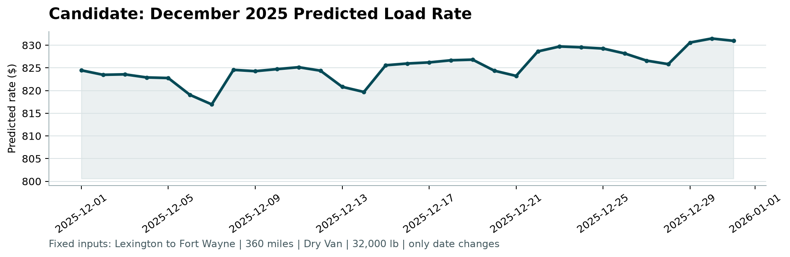

# Freight Rate Prediction 

Machine learning pipeline for spot freight rate forecasting across US trucking lanes, designed for out-of-sample forward horizon prediction (November/December 2025).

---

## 1. Project Overview

The objective is to predict commercial freight rates (`posted_rate` in USD) for:
1. **Validation Set**: 12,000 unlabelled historical spot loads across diverse national lanes (`output/validation_predictions.csv`).
2. **December 2025 Fixed-Lane Forecast**: 31 daily predictions for the fixed corridor **Lexington, KY to Fort Wayne, IN** (360 miles, Dry Van, 32,000 lb) reflecting weekly dynamics and quarter-end volume surges (`output/december_predictions.csv`).

---

## 2. December 2025 Predicted Freight Rates

Below is the candidate rate trajectory generated by the production model and validated by `score.py`:



### Key Dynamics Captured:
* **Base Corridor Rate**: Averaging **~$825.80** ($2.29/mile), aligning with historical corridor baselines for Dry Van freight.
* **Weekly Seasonality**: Predictable weekend volume dips (e.g., Dec 6–7, Dec 13–14, Dec 20–21).
* **End-of-Quarter Surge**: Cyclical rate rise in the final two weeks of the quarter leading into year-end peak freight demand (peaking at **$831.47** on Dec 30).

---

## 3. Methodology & Engineering Highlights

* **Label Cleaning**: Identified and filtered out corrupted outlier labels (~1.4% of training loads) where rate values were artificially distorted compared to standard distance pricing. Removing these noise labels keeps tree models focused on realistic market rates.
* **Log-Target Transformation**: Models are trained on the natural logarithm of freight rate to handle scale differences across short and cross-country routes and optimize percentage pricing error.
* **Quarter-End Seasonality**: Replaced static calendar numbers (month and week numbers that fail when forecasting unseen future months) with a dynamic `days_to_quarter_end` feature that captures commercial freight surges at the end of each quarter.
* **Forward-Chaining Validation**: Tested across rolling 2-month future horizons (predicting 61 days forward) to reflect true deployment performance.
* **Winning Model**: **`ExtraTreesRegressor`** proved most accurate and stable, achieving **2.72% Clean MAPE** across forward horizons.

### Model Benchmark (Aug–Sep 61-Day Forecast):
| Model Architecture | Clean MAE ($) | Clean RMSE ($) | Clean MAPE (%) | All-Row MAE ($) |
| :--- | :---: | :---: | :---: | :---: |
| **ExtraTrees (`max_features='sqrt'`)** | **$64.75** | **$98.61** | **2.72%** | **$115.13** |
| ExtraTrees (`max_features=1.0`) | $77.84 | $108.63 | 3.20% | $128.08 |
| HistGradientBoosting | $79.05 | $102.99 | 3.35% | $129.29 |
| RandomForest (`max_features=1.0`) | $80.61 | $112.12 | 3.34% | $130.77 |

---

## 4. Setup & Installation

### Prerequisites
* Python 3.10+ (tested on Python 3.12 / 3.13)
* Git

### Step-by-Step Environment Setup
```bash
# 1. Clone the repository
git clone https://github.com/SID4288/spotter.git
cd Assessment

# 2. Create and activate a virtual environment
python -m venv venv

# Windows (PowerShell):
venv\Scripts\Activate.ps1
# Windows (CMD):
venv\Scripts\activate.bat
# Linux / macOS:
source venv/bin/activate

# 3. Install dependencies
python -m pip install --upgrade pip
python -m pip install -r requirements.txt
```

### Dependencies (`requirements.txt`)
```text
matplotlib>=3.8,<4
numpy>=1.26,<3
pandas>=2.0,<3
seaborn==0.13.2
scikit-learn>=1.4,<2
```

---

## 5. Running the Pipeline

### Running the Jupyter Notebooks
You can inspect and run the exploratory data analysis and modeling workflows interactively:
1. **Exploratory Data Analysis**:
   ```bash
   jupyter notebook notebooks/eda.ipynb
   ```
2. **Feature Engineering & Modelling**:
   ```bash
   jupyter notebook notebooks/modelling.ipynb
   ```
   Executing `modelling.ipynb` runs the end-to-end data cleaning, multi-fold cross validation, final model fit, and automatically writes the required prediction deliverables to `output/`.

---

## 6. Official Scorer Verification

To validate submission formats, row counts, and generate the official candidate chart:
```bash
python score.py --predictions output/validation_predictions.csv --december-predictions output/december_predictions.csv
```

**Expected Output:**
```text
Validated 12,000 final predictions.
Validated 31 fixed December predictions.
Created chart: scorer_results/candidate_december.png
Final validation metrics are calculated by Spotter after submission.
```

---

## 7. Project Structure

```text
Assessment/
├── data/
│   ├── train_test.csv                       # Historical spot loads (Jan–Oct 2025)
│   ├── validation.csv                       # Unlabelled validation loads
│   ├── validation-predictions-template.csv  # Required submission template
│   └── december_chart_inputs.csv            # Original fixed-lane inputs (unchanged)
├── notebooks/
│   ├── eda.ipynb                            # Comprehensive exploratory analysis
│   ├── modelling.ipynb                      # Clean pipeline & multi-model evaluation
│   └── results/                             # Diagnostic & preview figures
├── output/
│   ├── validation_predictions.csv           # 12,000 validation rate predictions
│   └── december_predictions.csv             # 31 daily December 2025 rate predictions
├── scorer_results/
│   └── candidate_december.png               # Official chart output from score.py
├── readme.md                                # Project documentation & run instructions
├── requirements.txt                         # Environment dependencies
└── score.py                                 # Official assessment validator script
```
